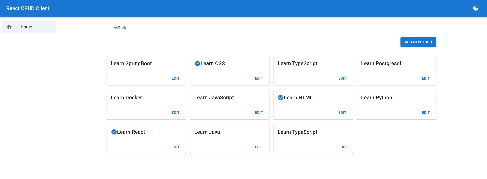

# Preview Project



## Project

##### This project queries Fake API to display tasks

#

### Technologies Used

<div>
    
    
    
</div>

#
  
### Functionalities
  - [X] Task query
  - [X] Detailed task query
  - [X] Add task

#

### How to run

##### You will need to clone the project

```
git clone https://github.com/estaeldev/task-todo.git
```

##### Install dependencies and run the init script

```
yarn

yarn start
```

##### Start mock [**`Json Server`**](https://www.npmjs.com/package/json-server) backend

```
yarn mock_server
```
#

### Demo Project

##### Access the link below to view the project

[**`Task Project Demo`**](https://task-todo-e7780.web.app/)

#
